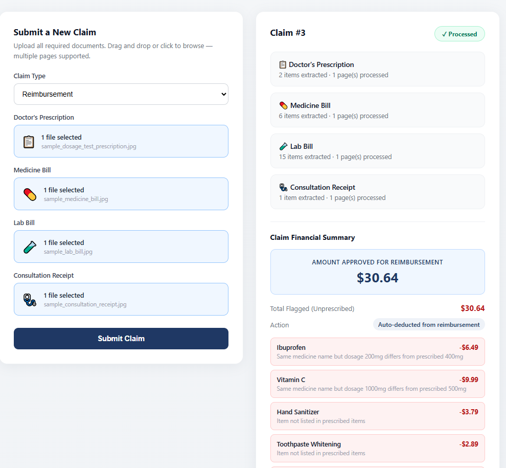
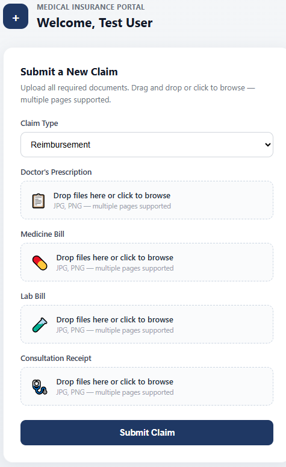

# AI-Powered Medical Insurance Claims Processing

An end-to-end system that automates medical insurance claim review: it reads scanned prescriptions, medicine bills, lab bills, and consultation receipts, cross-checks billed items against what was actually prescribed, and flags discrepancies — automatically, in seconds, instead of a human reviewer doing it by hand.

**Live demo:** [Frontend](https://medical-insurance-frontend.vercel.app) · [API docs](https://medical-insurance-backend-production.up.railway.app/docs)
Test login: `user@test.com` / `password123`



## The problem this solves

Manual insurance claim review means a human comparing a prescription against a pharmacy bill line by line, checking dosages match, and catching unprescribed items — slow, inconsistent, and expensive at scale. This system does that comparison automatically using OCR and an LLM extraction pipeline, and produces a structured deduction report with a dollar amount and a reason for every flagged item.

## Why this isn't just an OCR wrapper

The interesting engineering problem here isn't "call an OCR API" — it's **trusting AI output enough to make a financial decision, without trusting it blindly.**

Early testing surfaced a real failure mode: on blurry or low-quality document photos, the vision model would occasionally *hallucinate* plausible-looking medicine names and dosages instead of reporting that it couldn't read the text. In a claims context, a fabricated data point isn't a cosmetic bug — it's the system silently making up a reason to approve or deny money.

The fix is a three-layer safety net:
1. **Image quality scoring** before extraction even runs, to catch obviously unreadable documents early.
2. **Extraction-time confidence signals** — illegibility ratio, blank-field ratio — attached to every extracted item, not just a final yes/no.
3. **Automatic review-flagging**: any claim where confidence is below threshold is routed for human review instead of being auto-processed, so uncertainty never gets silently converted into a financial decision.

This is the part of the project I'd point to first in an interview — not the OCR integration, but the decision to build a system that knows when *not* to trust itself.

## Architecture

```
┌─────────────┐     ┌──────────────┐     ┌─────────────────┐
│   React     │────▶│   FastAPI    │────▶│  Groq (Vision)   │
│  Frontend   │     │   Backend    │     │  OCR Extraction  │
│  (Vercel)   │◀────│  (Railway)   │◀────│  Groq (Text)     │
└─────────────┘     └──────┬───────┘     │  Structured Data │
                            │             └─────────────────┘
                     ┌──────▼───────┐
                     │  PostgreSQL  │
                     │    (Neon)    │
                     └──────────────┘
```

**Pipeline per claim:** document upload → image quality check → OCR (vision model) → structured extraction (text model) → thinking-block cleanup → prescribed-vs-billed comparison → deduction calculation → review-flag decision → response.
## Tech stack

**Backend:** FastAPI, SQLAlchemy, PostgreSQL, JWT auth (python-jose + bcrypt), Groq SDK
**Frontend:** React 19, Vite
**AI:** `qwen/qwen3.6-27b` (vision — document OCR), `openai/gpt-oss-120b` (text — structured extraction & comparison reasoning)
**Infra:** Railway (backend), Vercel (frontend), Neon (managed Postgres)

## Key features

- Multi-document OCR across 4 document types per claim, multi-page support
- Structured data extraction with per-item confidence signals
- Prescribed-vs-billed comparison: catches dosage mismatches (e.g. 200mg billed vs 400mg prescribed) and unprescribed items
- Automatic deduction calculation with a human-readable reason per flagged item
- Review-flagging safety net for low-confidence extractions (see above)
- JWT-based auth with role support (user/admin)



## Running locally

```bash
git clone https://github.com/Laiba-Azhar0707/medical-insurance-backend.git
cd medical-insurance-backend
python -m venv venv
source venv/bin/activate  # or venv\Scripts\activate on Windows
pip install -r requirements.txt
cp .env.example .env  # fill in your own values
python init_db.py
python seed_users.py
uvicorn main:app --reload
```

Frontend: see [medical-insurance-frontend](https://github.com/Laiba-Azhar0707/medical-insurance-frontend).

## Testing

```bash
python test_suite.py       # unit tests
python test_end_to_end.py  # full pipeline, requires GROQ_API_KEY
```

## What I'd build next

- Persistent file storage (S3) instead of ephemeral container storage
- Confidence-score visualization in the frontend, so reviewers see *why* something was flagged, not just that it was
- Batch claim processing for bulk submissions
